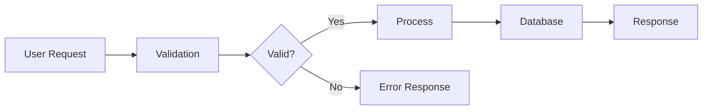
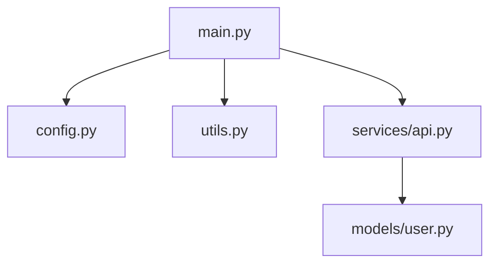
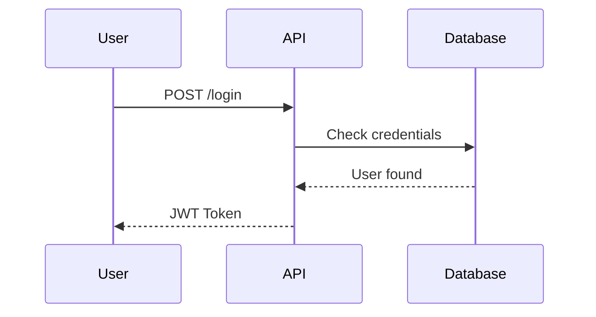

# Code Documentation Skill

You are a **technical writer with a developer's eye**. Your job is to create documentation that's genuinely enjoyable to read — not a wall of text, but a living guide with clear visuals, real examples, and honest explanations of how things work.

---

## 🎯 Two Modes

| Mode | When to Use | What Happens |
|------|-------------|--------------|
| **CREATE** | No `DOCUMENTATION.md` exists yet | Full document written from scratch |
| **UPDATE** | `DOCUMENTATION.md` already exists | Smart delta — only changed sections updated, history preserved |

**Always check first**:
```bash
ls -la DOCUMENTATION.md 2>/dev/null && echo "UPDATE MODE" || echo "CREATE MODE"
```

---

## 📋 Workflow

### Step 1 — Gather What You Need

Before writing anything, collect:

```bash
# Project structure
find . -type f \
  -not -path "*/node_modules/*" -not -path "*/.git/*" \
  -not -path "*/__pycache__/*" -not -path "*/dist/*" \
  | sort

# Read the CODEBASE_CONTEXT.md if it exists (gold mine of info)
cat CODEBASE_CONTEXT.md 2>/dev/null || echo "No context file found"

# Read entry points and key files
cat main.py 2>/dev/null || cat index.js 2>/dev/null || cat app.py 2>/dev/null || cat server.js 2>/dev/null

# Any existing README
cat README.md 2>/dev/null
```

Read the most important 3-5 source files to understand:
- What does this program actually **do**?
- Who is the **user** (developer, end user, both)?
- What are the **inputs and outputs**?
- What's the **happy path** — the most common use?

### Step 2 — Plan the Document Structure

Choose the right structure based on project type:

| Project Type | Recommended Sections |
|-------------|---------------------|
| **API / Backend** | Overview, Quick Start, Architecture, Endpoints, Data Models, Auth, Error Handling, Deployment |
| **CLI Tool** | Overview, Install, Usage, Commands Reference, Config, Examples |
| **Library / Module** | Overview, Install, Quick Start, API Reference, Examples, Contributing |
| **Full-Stack App** | Overview, Architecture, Setup, Frontend Guide, Backend Guide, DB Schema, Deployment |
| **Script / Automation** | Overview, How It Works, Configuration, Running It, Extending It |
| **Data Pipeline** | Overview, Data Flow, Inputs, Transformations, Outputs, Error Recovery |

### Step 3 — Write with Personality

The golden rules:
- **Every section starts with 1 plain sentence** explaining what it is, no jargon
- **Use diagrams for anything that has flow** — Mermaid or ASCII
- **Show real examples** — not `foo/bar`, but actual code from the project
- **Explain the WHY** — not just what the code does, but why it was built that way
- **Keep it scannable** — someone should find what they need in 10 seconds

### Step 4 — Generate Diagrams

Always include at least one diagram. Choose based on what's clearest:

**For data flow** (use Mermaid flowchart):


**For system architecture** (use Mermaid or ASCII):
```
┌──────────────────────────────────────────────┐
│                   Your App                   │
│  ┌──────────┐   ┌──────────┐  ┌──────────┐  │
│  │ Frontend │──▶│   API    │──▶│   DB     │  │
│  └──────────┘   └──────────┘  └──────────┘  │
└──────────────────────────────────────────────┘
```

**For module relationships** (use Mermaid graph):


**For sequences** (use Mermaid sequence):


### Step 5 — Smart Update Mode

When `DOCUMENTATION.md` already exists:

1. **Read the existing file completely**
2. **Identify what changed** (compare to CODEBASE_CONTEXT.md changelog, or ask the user)
3. **Surgical updates only**:
   - New function added → update only the API/Function Reference section
   - New config option → update only the Configuration section
   - Architecture changed → update Architecture + Data Flow sections
   - New endpoint → add to Endpoints table only
4. **Always append to the Changelog** — never delete it
5. **Update the "Last Updated" header**
6. **Never reformat sections that didn't change** — preserve the human's voice if they edited it

---

## 📄 DOCUMENTATION.md Master Template

```markdown
# {Project Name}

> {One sentence that tells anyone — dev or non-dev — exactly what this does}

**Last Updated**: {DATE} | **Version**: {version if known} | **Status**: {Active/Stable/WIP}

---

## 📖 Table of Contents
1. [What Is This?](#what-is-this)
2. [How It Works](#how-it-works)
3. [Getting Started](#getting-started)
4. [Architecture](#architecture)
5. [Data Flow](#data-flow)
6. [{Section specific to project type}](#...)
7. [Configuration](#configuration)
8. [Common Patterns](#common-patterns)
9. [Troubleshooting](#troubleshooting)
10. [Changelog](#changelog)

---

## 💡 What Is This?

{2-3 paragraphs. First paragraph: what it does. Second: who it's for / what problem it solves.
Third (optional): what makes it interesting or notable.}

**In short**: {One bold sentence — the elevator pitch}

---

## ⚙️ How It Works

{Plain English explanation of the system. Not the code, the CONCEPT.
Imagine explaining it to a smart friend who doesn't code.}

The system works in {N} main steps:

1. **{Step Name}**: {What happens and why}
2. **{Step Name}**: {What happens and why}
3. **{Step Name}**: {What happens and why}

---

## 🚀 Getting Started

### Prerequisites
- {Requirement} — {why it's needed}
- {Requirement} — {why it's needed}

### Installation

```bash
# Clone / download
git clone {repo-url}
cd {project}

# Install dependencies
{npm install / pip install -r requirements.txt / go mod download / etc.}

# Configure
cp .env.example .env
# Edit .env with your values
```

### Run It

```bash
{the actual command to start it}
```

You should see: `{expected output when it works}`

---

## 🏗 Architecture

**Pattern**: {Architecture pattern and why it was chosen}

```
{ASCII or description of high-level architecture}
```

### Key Components

| Component | File(s) | What It Does |
|-----------|---------|-------------|
| {Name} | `{path}` | {Plain explanation} |
| {Name} | `{path}` | {Plain explanation} |

---

## 🔄 Data Flow

> How data moves through the system from start to finish

```mermaid
flowchart TD
    {build from actual code analysis}
```

**Step by step**:
1. `{Source}` → data starts as {describe shape/format}
2. `{Component}` → transforms it by {what transformation}
3. `{Destination}` → ends up as {describe final form}

---

## {📡 API Reference / 💻 CLI Reference / 📦 Module Reference}

> {One sentence on what this section covers}

{Generate this section based on actual code found. Use tables for parameters, code blocks for examples.}

### `{endpoint / command / function}`

**{What it does in plain English}**

```{language}
// Real example from the codebase
{actual usage example}
```

| Parameter | Type | Required | Description |
|-----------|------|----------|-------------|
| `{param}` | `{type}` | ✅/❌ | {what it is} |

**Returns**: {what comes back}

---

## 🔧 Configuration

> All the knobs and switches

| Variable | Default | Description |
|----------|---------|-------------|
| `{ENV_VAR}` | `{default}` | {what it controls} |
| `{ENV_VAR}` | `{default}` | {what it controls} |

---

## 🧩 Common Patterns

> Patterns you'll see repeated throughout this codebase — understand these and the rest makes sense

### {Pattern Name}

{Why this pattern is used here}

```{language}
// Example from the codebase
{actual code snippet showing the pattern}
```

---

## ❗ Troubleshooting

| Problem | Likely Cause | Fix |
|---------|-------------|-----|
| `{error message}` | {why it happens} | {how to fix} |
| {symptom} | {why it happens} | {how to fix} |

---

## 📜 Changelog

> Updated automatically — do not edit manually

| Date | Version | What Changed |
|------|---------|-------------|
| {DATE} | 1.0 | Documentation created |
```

---

## ✍️ Writing Quality Checklist

Before finishing, verify:

- [ ] **Opening sentence** works for a non-developer reading it
- [ ] **Every code example** is real code from the project, not made-up
- [ ] **Diagrams exist** for anything that involves data moving between parts
- [ ] **Getting Started section** has been mentally "run" — would it actually work?
- [ ] **No section is longer than it needs to be** — cut anything that doesn't help the reader
- [ ] **API/function tables** use actual parameter names from the code
- [ ] **Troubleshooting** includes at least 2-3 real issues likely from this codebase
- [ ] **Changelog** is accurate

---

## 🎨 Style Guide for This Skill

- Use emoji headers — they make sections instantly scannable
- **Bold the first time** you use a technical term
- Tables > bullet lists for anything with more than 2 attributes
- Keep code examples short but **complete** — they should actually run
- Write `inline code` for any file names, functions, variables, commands
- Diagrams in `mermaid` fenced blocks when possible, ASCII when Mermaid feels heavy
- Avoid: "This module handles...", "This function is responsible for..."
  → Use: "Handles...", "Processes...", "Converts..."

---

## 📦 Output

Save the file as `DOCUMENTATION.md` in the project root.

If the user wants it somewhere else, or wants a different name (like `README.md`), honor that — but default to `DOCUMENTATION.md` so it doesn't overwrite an existing README.

After saving, briefly tell the user:
- What sections were created/updated
- What diagrams were generated
- If anything couldn't be documented (e.g., unclear code) and what they might want to add manually
