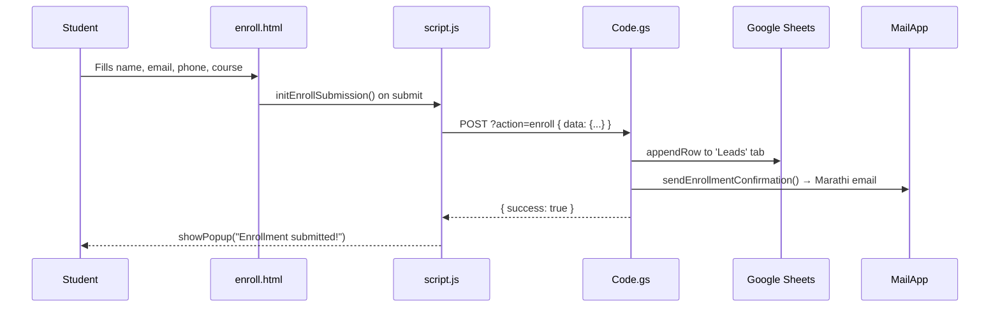

# UPSC Academia

> A full-stack coaching institute website with enrollment management, admitted student registration, a staff portal, and study notes system — built on HTML/CSS/JS + Google Apps Script.

**Last Updated**: 2026-03-04 | **Version**: 1.0 | **Status**: Active

---

## 📖 Table of Contents
1. [What Is This?](#-what-is-this)
2. [How It Works](#️-how-it-works)
3. [Getting Started](#-getting-started)
4. [Architecture](#-architecture)
5. [Data Flow](#-data-flow)
6. [Page Reference](#-page-reference)
7. [API Reference](#-api-reference-google-apps-script)
8. [Configuration](#️-configuration)
9. [Common Patterns](#-common-patterns)
10. [Troubleshooting](#-troubleshooting)
11. [Changelog](#-changelog)

---

## 💡 What Is This?

UPSC Academia is the official website and backend system for a premier civil services coaching institute in Pune, Maharashtra. It is not just a brochure site — it doubles as an operational platform that powers real student workflows.

**In short**: A coaching institute's complete digital platform — public website + enrollment system + admitted student registration + staff portal, all glued together by Google Apps Script as the serverless backend.

The project is deliberately lightweight: no Node.js server, no database server, no framework. Everything runs on GitHub Pages (static hosting) with Google Sheets acting as the database and Google Apps Script as the API layer.

---

## ⚙️ How It Works

The system works in 3 main layers:

1. **Frontend (HTML/CSS/JS)**: Five HTML pages served statically from GitHub Pages. A shared `script.js` handles all interactivity. Pages are identified by their `<body id>` attribute, which the JS uses to decide which init function to run — a lightweight client-side routing pattern.

2. **Config Bridge (`config.js`)**: A single file containing the Google Apps Script Web App URL. All pages import this before `script.js`, so changing the deployment URL is a one-line change.

3. **Backend (Google Apps Script — `Code.gs`)**: A single GAS file deployed as a Web App. It receives all HTTP requests, routes them via a `switch(action)` statement, interacts with Google Sheets and Google Drive, sends emails via MailApp, and returns JSON responses.

```
Browser ──fetch──▶ config.js [SCRIPT_URL] ──▶ Code.gs (GAS Web App)
                                                    │
                                      ┌─────────────┴─────────────┐
                                 Google Sheets              Google Drive
                                (Leads, Users,            (Study notes files)
                               student_registration)
```

---

## 🚀 Getting Started

### Prerequisites
- A modern web browser (Chrome, Firefox, Edge)
- A Google Account (for managing Sheets, Drive, and GAS deployment)
- Git (for pushing to GitHub Pages)

### Viewing the Site Locally

The project has no build step. Open any HTML file directly in a browser:

```bash
# Clone the repo
git clone https://github.com/your-org/UPSC_ACADEMIA.git
cd UPSC_ACADEMIA

# Open in browser (Windows)
start index.html
```

> ⚠️ Some features (layout injection, API calls) require a local server because `fetch()` won't work from `file://`. Use VS Code Live Server extension or `npx serve .` for full functionality.

### Updating the Backend API URL

```js
// config.js — change this ONE line
const CONFIG = {
    SCRIPT_URL: "https://script.google.com/macros/s/YOUR_DEPLOYMENT_ID/exec",
};
window.CONFIG = CONFIG;
```

### Deploying to GitHub Pages

Push to the `main` branch. GitHub Actions (`static.yml`) will automatically deploy:

```bash
git add .
git commit -m "Your changes"
git push origin main
```

Live at: `https://upscacademia.in` (custom domain configured on GitHub Pages)

### Deploying the Backend (Code.gs)

1. Open the linked Google Spreadsheet → **Extensions > Apps Script**
2. Paste/edit `Code.gs`
3. Click **Deploy > Manage Deployments > Create New Deployment**
4. Set type to **Web App**, access to **Anyone**
5. Copy the new URL → paste into `config.js`
6. Commit and push `config.js`

---

## 🏗 Architecture

**Pattern**: Multi-Page Static Site + Serverless Monolith (Google Apps Script)

```
┌──────────────────────── GitHub Pages ────────────────────────────┐
│  index.html      Public website (home, about, services, FAQ)      │
│  enroll.html     Demo class booking form                          │
│  login.html      Staff portal (full SPA-like dashboard)          │
│  admitted-        Mahajyoti student online registration           │
│  registration.html (3-step flow)                                  │
│  view_notes.html  Study notes browser                             │
│                                                                  │
│  Shared: style.css   script.js   config.js                       │
│  Components: header.html   footer.html (fetched at runtime)      │
└──────────────────────────────┬───────────────────────────────────┘
                               │ fetch (GET/POST)
                               ▼
┌──────────────────── Google Apps Script ──────────────────────────┐
│  doGet / doPost → handleApiRequest → switch(action)              │
│                                                                  │
│  13 actions: signup, login, enroll, getLeads, upload,            │
│  deleteFile, getFiles, download, forgotPassword, verifyOTP,      │
│  verifyMahajyoti, registerAdmitted, getRegistrations             │
└────────────┬────────────────────────────┬────────────────────────┘
             │                            │
    ┌─────────▼──────────┐    ┌───────────▼───────────┐
    │   Google Sheets     │    │     Google Drive       │
    │  - Leads           │    │  - Study notes PDFs    │
    │  - Users           │    │    (FOLDER_ID)         │
    │  - student_        │    └───────────────────────┘
    │    registration    │
    └────────────────────┘
```

### Key Components

| Component | File(s) | What It Does |
|-----------|---------|-------------|
| Public Website | `index.html` + `style.css` | Marketing site with hero, about, services, facilities, FAQ, contact + Google Maps |
| Shared Layout | `header.html`, `footer.html` | Reusable navbar + footer fetched dynamically via JS |
| Shared Logic | `script.js` | Page routing, layout injection, all page init functions, API calls, popups |
| API Config | `config.js` | Holds the GAS Web App URL. Single source of truth. |
| Backend | `Code.gs` | All serverless logic: auth, sheets R/W, Drive, email |
| Staff Portal | `login.html` | Full auth + admin dashboard with leads + registrations tabs |
| Student Reg | `admitted-registration.html` | 3-step Mahajyoti student online registration |
| Notes | `view_notes.html` | Fetches and renders study notes from Google Drive |

---

## 🔄 Data Flow

### Enrollment (Demo Class Booking)



### Admitted Student Registration (3-Step)

```
Step 1: Verify
  Student enters Mahajyoti Reg ID
      ↓ GET ?action=verifyMahajyoti&mid=XXX
      ↓ Code.gs searches 'student_registration' sheet
      ↓ Returns student data or error / already_registered flag

Step 2: Fill Details
  Form auto-fills name, batch, DOB, gender (readonly)
  Student adds WhatsApp number, email, address
      ↓ POST { action: 'registerAdmitted', data: {...} }
      ↓ Code.gs updates the sheet row, sets online_registered = TRUE

Step 3: Join Groups
  WhatsApp + Telegram group links shown
  Registration complete ✅
```

### Staff Portal Flow

```
Staff→ login.html → POST { action: 'login' }
    ↓ processLogin() checks Users sheet, Admin_consent must = '1'
    ↓ Grants access → dashboard loads

Dashboard Tabs:
  "Demo Requests" → GET ?action=getLeads → Leads sheet
  "Registrations" → GET ?action=getRegistrations → student_registration sheet

File Management (Notes tab):
  Upload → POST { action: 'upload', base64Data, fileName } → Drive
  Delete → GET ?action=deleteFile&fileId=XXX → Drive trash
  Download → GET ?action=download&id=XXX → base64 blob response
```

---

## 📄 Page Reference

### `index.html` — Home Page
- `<body id="home-page">`
- Sections: Hero, About (Director profile), Services (9 coaching types), Facilities (6 items), Resources (apps + YouTube + Telegram + WhatsApp), FAQ (accordion), Contact (phone/email/address + Google Maps iframe)
- JS init: `initHomePage()` → `initScrollEffects()`, `initMapLoader()`, `initFAQ()`

### `enroll.html` — Demo Class Booking
- `<body id="enroll-page">`
- Single form: Name, Email, Phone, Course dropdown
- JS init: `initEnrollPage()` + `initEnrollSubmission()`
- Sends data to GAS → triggers enrollment confirmation email

### `admitted-registration.html` — Mahajyoti Online Registration
- `<body id="admitted-reg-page">`
- 3-step wizard with progress indicator dots
- Step 1: Reg ID verification. Step 2: Registration form. Step 3: Group join links
- JS init: `initAdmittedRegistration()`
- Includes honeypot field and phone/email/guardian/address validation

### `login.html` — Staff Portal
- No `<body id>` routing (all logic inline)
- Tabs: Login, Signup, Forgot Password, Dashboard
- Dashboard sub-tabs: Demo Requests (leads), Registrations (admitted students), Notes (file manager)
- Admin approval required: `Admin_consent = '1'` in Users sheet

### `view_notes.html` — Study Notes
- `<body id="notes-page">`
- Fetches file list from Google Drive via GAS
- Each file: View (Google Drive link) + Download (base64 proxy)
- Search input filters notes client-side

---

## 📡 API Reference (Google Apps Script)

> All requests go to `CONFIG.SCRIPT_URL`. GET for data fetching, POST for mutations.

### `action=signup`
**Registers a new staff account (pending admin approval)**

```js
POST { action: 'signup', data: JSON.stringify({ name, email, password }) }
// Returns: { success: true, message: 'Registration successful! Pending Admin approval.' }
```

| Field | Required | Notes |
|-------|----------|-------|
| `name` | ✅ | Staff member name |
| `email` | ✅ | Must be unique and valid email |
| `password` | ✅ | Stored as plaintext ⚠️ |

### `action=login`
**Authenticates a staff member**

```js
POST { action: 'login', data: JSON.stringify({ email, password }) }
// Returns: { success: true, userName: 'Sahil', message: 'Login Successful!' }
// OR: { success: false, message: 'Account Pending Admin approval.' }
```

### `action=enroll`
**Saves a demo class booking and sends confirmation email**

```js
POST { action: 'enroll', data: JSON.stringify({ name, email, phone, course }) }
// Returns: { success: true, message: 'Enrollment successful!' }
```

### `action=getLeads`
**Returns all demo class bookings (newest first)**

```js
GET ?action=getLeads
// Returns: { success: true, leads: [{ timestamp, name, email, phone, course, status }] }
```

### `action=verifyMahajyoti`
**Validates a Mahajyoti Reg ID and returns student data**

```js
GET ?action=verifyMahajyoti&mid=REG12345
// Returns: {
//   success: true, exists: true, already_registered: false,
//   rowIndex: 5,
//   data: { 'reg id': '...', 'candidates name': '...', 'batch name': '...', ... }
// }
```

### `action=registerAdmitted`
**Completes online registration for an admitted student**

```js
POST { action: 'registerAdmitted', data: JSON.stringify({
  mid, whatsapp_number, email, address, website /* honeypot */
}) }
// Returns: { success: true, message: 'Registration successful!' }
// Blocks: duplicates (already_registered = TRUE)
```

### `action=getRegistrations`
**Returns all online-registered students for staff dashboard**

```js
GET ?action=getRegistrations
// Returns: { success: true, registrations: [{
//   reg_id, name, percentile, dob, gender, category,
//   mob_no, batch_name, whatsapp_number, email, address, registration_date
// }] }
```

### `action=getFiles`
**Lists study notes files from Google Drive**

```js
GET ?action=getFiles
// Returns: { success: true, files: [{ name, url, downloadUrl, type, id }] }
```

### `action=download`
**Proxy-downloads a Drive file as base64**

```js
GET ?action=download&id=GOOGLE_DRIVE_FILE_ID
// Returns: { success: true, data: '<base64>', fileName: '...', mimeType: '...' }
```

### `action=upload`
**Uploads a file to Google Drive (staff only)**

```js
POST { action: 'upload', data: JSON.stringify({ base64Data: 'data:mime;base64,...', fileName }) }
// Returns: { success: true, url: 'https://drive.google.com/...' }
```

### `action=forgotPassword` / `action=verifyOTP`
**Password recovery via email OTP (10-minute expiry)**

```js
POST { action: 'forgotPassword', data: JSON.stringify({ email }) }
// Sends 6-digit OTP to email. Returns: { success: true, showOTPInput: true }

POST { action: 'verifyOTP', data: JSON.stringify({ email, otp }) }
// Returns: { success: true, password: '...' }  ⚠️ password returned in plaintext
```

---

## 🔧 Configuration

| Variable | Location | Description |
|----------|----------|-------------|
| `SCRIPT_URL` | `config.js` | Google Apps Script Web App deployment URL |
| `FOLDER_ID` | `Code.gs:15` | Google Drive folder ID for study notes files |
| `SPREADSHEET_ID` | `Code.gs:16` | Google Sheets spreadsheet ID for all data |
| BCC Email | `Code.gs:562` | Hardcoded BCC for enrollment confirmation emails |
| Admin phone | `Code.gs:440` | Hardcoded in enrollment email: `7666818376` |

### Google Sheets Tab Structure

| Tab Name | Purpose | Key Columns |
|----------|---------|-------------|
| `Leads` | Demo class bookings | Timestamp, Name, Email, Phone, Course, Status |
| `Users` | Staff portal accounts | Name, Email, Password, Access, Link, OTP, OTP_Expiry, Admin_consent |
| `student_registration` | Mahajyoti admitted students | Reg Id, Candidates Name, Percentile Scores, DOB, Gender, Category, Mob No, Batch Name, WhatsApp Number, Email Id, Full Address, online_registered, online_registration_date |

---

## 🧩 Common Patterns

### Page Routing by Body ID

Every HTML page declares a unique body ID. `script.js` reads it on load and branches:

```js
// script.js — DOMContentLoaded handler
const bodyId = document.body.id
if (bodyId === "home-page") {
    initHomePage()
} else if (bodyId === "notes-page") {
    initNotesPage()
} else if (bodyId === "enroll-page") {
    initEnrollPage()
} else if (bodyId === "admitted-reg-page") {
    initAdmittedRegistration()
}
```

### API Call Pattern

All GAS API calls follow this shape:

```js
// GET
const response = await fetch(`${APPS_SCRIPT_URL}?action=getLeads`)
const data = await response.json()
// data → { success: true/false, leads: [...], message: '...' }

// POST
const params = new URLSearchParams()
params.append("action", "enroll")
params.append("data", JSON.stringify(enrollData))
const res = await fetch(APPS_SCRIPT_URL, {
    method: "POST",
    headers: { "Content-Type": "application/x-www-form-urlencoded" },
    body: params,
})
```

### Layout Component Injection

Header and footer are separate HTML files fetched at runtime (not server-side includes):

```js
// script.js: loadLayoutComponents()
const [headerRes, footerRes] = await Promise.all([
    fetch("header.html"),
    fetch("footer.html"),
])
headerHost.outerHTML = await headerRes.text()
footerHost.outerHTML = await footerRes.text()
// Then re-initialize nav behavior
initMobileMenu()
markActiveNavLink()
```

### Toast Notifications

Use `showPopup(message, type)` anywhere for user feedback:

```js
showPopup("Enrollment submitted successfully!", "success")
showPopup("⚠️ Please enter a valid phone number.", "error")
// Appears top-right, auto-dismisses after 4 seconds
```

---

## ❗ Troubleshooting

| Problem | Likely Cause | Fix |
|---------|-------------|-----|
| Header/footer missing on page | `fetch("header.html")` fails in `file://` | Use VS Code Live Server or `npx serve .` locally |
| API calls return `undefined` or CORS error | GAS Web App not deployed as "Anyone" | Re-deploy GAS with access set to "Anyone (even anonymous)" |
| Enrollment form says "Network error" | Wrong `SCRIPT_URL` in `config.js` | Verify URL from GAS Deploy > Manage Deployments |
| Staff login says "Pending Admin approval" | `Admin_consent` column in Users sheet is `0` | Open Spreadsheet → Users tab → set column H to `1` for that user |
| Student Reg ID not found | Reg ID not in `student_registration` sheet, or column header mismatch | Check sheet has column "Reg Id" (case-insensitive); `verifyMahajyotiId` searches `reg id`, `reg_id`, `mahajyoti_id` |
| Notes not loading | `FOLDER_ID` in `Code.gs` is wrong or files not shared | Verify the Drive folder ID; ensure GAS has Drive permission (re-authorize) |
| Map not showing on mobile | iframe blocked by browser privacy settings | User can click "Open in Google Maps" fallback link |
| Particles making page slow | Too many particles on low-end device | They're auto-disabled on very small screens; `optimizeForMobile()` handles this |

---

## 📜 Changelog

| Date | Version | What Changed |
|------|---------|-------------|
| 2026-03-04 | 1.0 | Documentation created using code-docs skill |
| 2026-03-02 | — | Fixed Mahajyoti column header mismatch in staff portal |
| 2026-03-01 | — | Fixed invisible text in readonly registration fields; SEO fixes |
| 2026-02-28 | — | Added duplicate registration prevention; added Registrations tab to staff portal |
| 2026-02-27 | — | Comprehensive debug audit and code cleanup |
